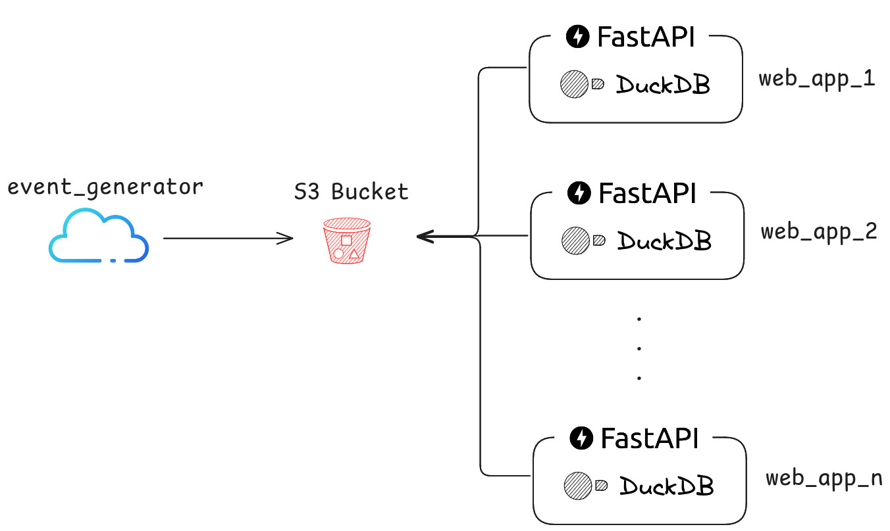
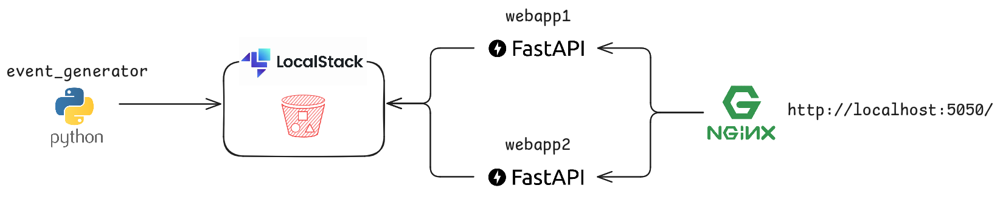

# API REST para seleção de pools de instâncias

## Introdução

Este é um exemplo de aplicação, que tem por objetivo a consultar dados de eventos de Spark Jobs salvos em um Bucket S3 e retornar o melhor pool de instâncias EC2 no momento de sua chamada.

A aplicação foi desenvolvida utilizando o framework [FastAPI](https://fastapi.tiangolo.com/), a fim de disponibilizar uma API REST com o endpoint `get-pool`, que por sua vez retornaria o pool com mais chances de executar um novo Spark Job sem falhas de Spot instance. A escolha do FastAPI se deu principalmente por sua alta performance e simplicidade de uso, tornando possível escrever um código simples, porém robusto.

O log de eventos passados é escrito em um arquivo no formato `.json` em um bucket S3. O arquivo possui um evento para cada linha. Existem várias formas de se consultar estes dados para analisá-los, a depender do tamanho do arquivo e disponibilidade de recursos. Ainda com o objetivo de manter o código simples, mas resiliente, o [DuckDB](https://duckdb.org/) foi escolhido como ferramenta de acesso a estes dados no S3. Uma possível melhoria seria utilizar o [Amazon Athena](https://aws.amazon.com/pt/athena/) caso o arquivo fique extremamente grande e não tenha uma política de [log rotation](https://en.wikipedia.org/wiki/Log_rotation).

Como os dados a serem analisados pela API REST estão centralizados no S3, a aplicação pode ser replicada em várias instâncias sem termos que preocupar com [race condition](https://en.wikipedia.org/wiki/Race_condition).

Na figura abaixo, podemos ver um diagrama geral da solução;



## Funcionamento interno da API REST

Como o objetivo principal do endpoint `get-pool` da API REST é retornar o pool de instâncias com mais chance de não falhar por falta de Spot Instance, foi escrita uma consulta em SQL, que retorna o pool com menor porcentagem de falhas por indisponibilidade de Spot Instance.

SQL que retorna a melhor instância:
```sql
WITH cte as (
  SELECT pool_id,
         COUNT(*) AS qtde,
         COUNT(*) FILTER(reason = 'SPOT_INSTANCE_TERMINATION') AS qtde_spot_instance_termination
  FROM 's3://{S3_BUCKET_NAME}/{S3_FILE_NAME}'
  WHERE {FILTROS}
  GROUP BY pool_id
)
SELECT pool_id
FROM cte
ORDER BY qtde_spot_instance_termination / qtde
LIMIT 1;
```

Nesta consulta são selecionados todos os eventos do arquivo `.json` no S3, porém aplicando os filtros disponibilizados. Os eventos são então agrupados por `pool_id`, obtendo-se então a porcentagem de falhas com o `reason` "SPOT_INSTANCE_TERMINATION" para cada `pool_id`. Finalmente é retornado o pool com a menor porcentagem de falhas.

Existem dois tipos de filtro possível:

1. `instance_type`: Serve para limitar o resultado a apenas alguns tipos de instância EC2. Ele é passado diretamente na URL da requisição. Exemplo: `http://localhost:5050/get-pool?instance_types=c6a.xlarge,m6a.xlarge`
2. `EVENT_FILTER_WINDOW`: Esta é uma variável de ambiente passada para a aplicação no momento do seu deploy (Kubernetes, por exemplo). O valor desta variável de ambiente indica quantos segundos devem ser considerados como filtro de janela de tempo. Exemplo: se for passado `86400`, a consulta somente considera os eventos das últimas 24 horas.

## Desenvolvimento

Para desenvolvimento e testes em um computador local, foi disponibilizado neste repositório o arquivo [docker-compose.yml](docker-compose.yml), que executa localmente todos os contêineres necessários. Neste exemplo, foi utilizada a aplicação [Watchtower](https://containrrr.dev/watchtower/) para monitorar automaticamente atualizações na imagem do container da API REST.

Foi disponibilizada também uma aplicação chamada `event_generator`, que simula a geração de eventos de Spark Job de forma aleatória, gerando cada evento entre 0 e 2 segundos. O código desta aplicação está na pasta [src/event_generator](src/event_generator).

O código da API REST está na pasta [src/web_app](src/web_app).

Para simular o ambiente do Amazon S3, foi utilizado o [LocalStack](https://www.localstack.cloud/).

E finalmente, para se testar o funcionamento da API REST sendo executada em várias instâncias, foi utilizado o [nginx](https://nginx.org/) para emular um load balancer entre as instâncias.

Diagrama da aplicação sendo executada através do Docker Compose disponibilizado:



Para iniciar a execução de todos os contêineres localmente de forma orquestrada, basta executar o seguinte comando na pasta raiz do repositório:

```bash
docker compose up
```

Após alguns segundos, a API REST estará disponível através da URL `http://localhost:5050/get-pool`.

### Configurações

O arquivo [.env](.env) pode ser utilizado para algumas configurações da API REST.

Segue o detalhamento de cada variável de ambiente:

- `LOCALSTACK_PORT`: Porta principal do LocalStack. Caso a aplicação utilize o AWS diretamente, deixe esta variável vazia;

- `LOCALSTACK_URL`: URL de acesso ao LocalStack. Caso a aplicação utilize o AWS diretamente, deixe esta variável vazia;

- `S3_BUCKET_NAME`: Nome do bucket do S3;

- `S3_FILE_NAME`: Caminho do arquivo `.json` dentro do bucket;

- `AWS_KEY_ID`: O ID da chave de acesso ao AWS;

- `AWS_SECRET`: A secret da chave de acesso ao AWS;

- `EVENT_FILTER_WINDOW`: Explicado na seção [Funcionamento interno da API REST](#funcionamento-interno-da-api-rest);

- `LOG_LEVEL`: Nível de log a ser gerado pela aplicação. Podendo ter os valores "NOTSET", "DEBUG", "INFO", "WARNING", "ERROR" ou "CRITICAL".

### Manutenção do código

Este repositório possui uma esteira de CI/CD de forma a fazer várias verificações automatizadas para cada pull request criado, além de fazer o deploy automático das imagens de container, caso seja feito o merge na branch main.

#### CI - Continuous Integration

Para cada pull request é executado um workflow do Github Actions, definido pelo arquivo [checks.yml](.github/workflows/checks.yml).

As verificações feitas são:

1. `isort`: Ordena os imports dos arquivos Python, a fim de padronizar e diminuir o volume de linhas alteradas no pull request;

2. `black`: Formatação automática dos arquivos Python, que da mesma forma do `isort`, tende a diminuir o volume de linhas alteradas, de forma a facilitar a visualização somente do que foi realmente alterado;

3. `flake8`: Verifica erros de sintaxe e falta de documentação (docstrings) nos arquivos Python;

4. `mypy`: Verifica se todo o código está com tipagem e se os tipos foram utilizados de forma correta;

5. `pytest`: São executados todos os testes definidos na pasta [tests/](tests);

#### CD - Continuous deployment

Quando e aplicado um merge na branch `main` é executado um workflow do Github Actions, definido no arquivo [deploy.yml](.github/workflows/deploy.yml). Este workflow realiza o build e push de forma automática das imagens de container da API REST e do gerador de eventos de teste para o Docker Hub.